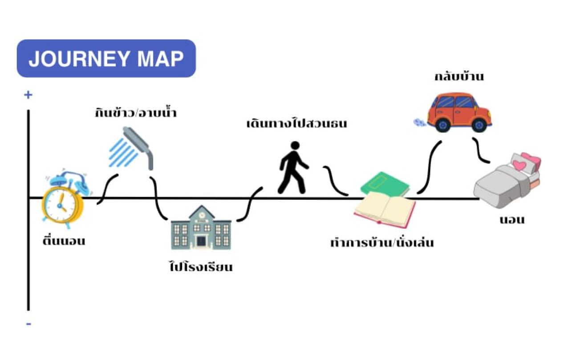

## EMPATHIZE
พวกเราได้ลงความเห็นกันว่าจะเลือกไปสัมภาษณ์ผู้ใช้ที่ไหน ซึ่งได้ข้อสรุปว่าจะไปสัมภาษณ์ผู้ใช้ที่สวนธนบุรีรมณ์ แล้วก็ไป empathize เพื่อเก็บข้อมูลของผู้ใช้มาใช้งาน โดยพวกเราได้เตรียมคำถามในการสัมภาษณ์เพื่อจะได้นำข้อมูลมาวิเคราะห์

**Interview script**  
1.ถามชื่อ อายุ อาชีพ และที่อยู่คร่าวๆของ user  
2.ให้ user เล่ากิจวัตรประจำวันคร่าวๆ  
3.เดินทางมาสวนธนบุรีรมณ์อย่างไร  
4.มาที่สวนธนบุรีรมณ์บ่อยแค่ไหน  
5.มาทำอะไรที่สวนธนบุรีรมณ์  
6.รู้สึกอย่างไรกับสวนธนบุรีรมณ์  
7.พอใจและไม่พอใจในเรื่องอะไรบ้างเกี่ยวกับสวนธนบุรีรมณ์  
8.เป้าหมายที่มาที่สวนธนบุรีรมณ์  
9.อยากให้มีอะไรเพิ่มเติมในสวนธนบุรีรมณ์  

## สิ่งที่ผู้ใช้งานบอกเรา
**1.คุณยายนงค์**
-  ยายนงค์อายุ 65 ปี เกษียณแล้ว อาศัยอยู่ใกล้กับสวนธนบุรีรมณ์ โดยตื่นมาคุณยายก็อาบน้ำ รับประทานอาหารและทำกิจวัตรประจำวัน จากนั้นก็เดินมาที่สวนธนบุรีรมณ์ในช่วงเย็นๆเพื่อวิ่งออกกำลังกาย พอออกกำลังกายเสร็จก็กลับบ้านพักผ่อนในช่วง 19:00 น. และนอนเวลา 20:00 น. โดยคุณยายมาสวนธนบุรีรมณ์ทุกๆวัน โดยรู้สึกว่าสวนธนบุรีรมณ์มีอากาศที่ร่มเย็นดี สวนอยู่ใกล้บ้านและมีคนออกกำลังกายเยอะซึ่งเป็นสื่งที่คุณยายพอใจ แต่คุณยายไม่พอใจในเรื่อง ในบางครั้งแดดร้อนไปหน่อยและมีของชำรุดค่อนข้างเยอะ โดยเป้าหมายของคุณยายก็คืออยากดูและสุขภาพเพราะอายุค่อนข้างเยอะแล้วและก็อยากมีเพื่อนแก้เหงาเวลาวิ่งออกกำลังกายเยอะๆ ซึ่งคุณยายก็ยังบอกอีกว่าอยากให้มีที่บอกอุณหภูมิว่าวันนี้สวนธนร้อนแค่ไหนและอยากให้มีที่แจ้งของที่ชำรุดแบบง่ายๆ เพราะบางทียายไม่รู้จะไปแจ้งที่ไหนและมันก็ยุ่งยากวุ่นวาย นอกจากนี้ยายก็อยากจะรู้ข่าวสารของสวนธนบุรีรมณ์ให้มากขึ้นอีกด้วย

**2.คุณลุงพิชิต**
- คุณลุงพิชิตอายุ 75 ปีเกษียณแล้ว อาศัยอยู่ใกล้กับสวนธนบุรีรมณ์ โดยตื่นมาคุณลุงก็ล้างหน้า แปรงฟันจากนั้นก็เดินมาสวนธนบุรีรมณ์ตั้งแต่เช้าเพื่อสูดอากาศบริสุทธิ์และออกกำลังกาย จากนั้นก็กลับบ้านรับประทานอาหารและทำกิจวัตรประจำวัน พอตอนเย็นก็เดินมาที่สวนธนบุรีรมณ์อีกรอบเพื่อตีปิงปองกับเพื่อนๆและเด็กๆ พอตีเสร็จก็กลับบ้านรับประทานอาหาร พักผ่อนในช่วง 18:30 น. และนอนตอนช่วง 20:00 น. โดยคุณลุงมาสวนธนบุรีรมณ์ในตอนเช้าทุกวัน ส่วนตอนเย็นก็มาบ้างไม่มาบ้างแล้วแต่ว่าวันนั้นมีคนตีปิงปองด้วยหรือไม่ ซึ่งคุณลุงรู้สึกว่าตอนเช้าอากาศเย็นสบายสดชื่นดีมาก ตอนเย็นก็ปกติเฉยๆ มีแดดบ้างนิดหน่อย แต่คุณลุงไม่พอใจในส่วนของอุปกรณ์กีฬาทั้งอุปกรณ์ในยิมและอุปกรณ์กีฬาปิงปอง เพราะมีน้อย ชำรุดง่าย และคนใช้ค่อนข้างเยอะ โดยเป้าหมายของคุณลุงที่มาที่สวนธนบุรีรมณ์ก็คือลุงอยากมาสูดอากาศบริสุทธิ์ในตอนเช้าและมาตีปิงปองกับคนอื่นในตอนเย็นๆก็เพื่อมาเอาสังคม

**3.น้องบี**
- น้องบีอายุ 15 ปี กำลังศึกษาอยู่ที่โรงเรียนวัดนาหลวง โดยตั้งแต่ตื่นขึ้นมาน้องบีก็รับประทานอาหารและแต่งตัวไปโรงเรียน พอเลิกเรียนก็เดินทางมาสวนธนบุรีรมณ์เพื่อทำการบ้าน นั่งเล่นกับเพื่อน และรอผู้ปกครองมารับ พอผู้ปกครองมารับกลับบ้านก็รับประทานอาหารตอน 18:00 น.จากนั้นก็นั่งเล่นและนอนตอนช่วง 22:00 น. โดยนอนบีไม่ได้มาสวนธนบุรีรมณ์ทุกวัน มาบ้างเป็นบางวัน โดยในแต่ละวันที่น้องบีมาทำการบ้าน น้องบีก็เจอปัญหาแดดมาลงตรงโต๊ะที่น้องบีทำการบ้าน น้องบีเลยต้องคอยลุกเปลี่ยนที่อยู่ตลอด แต่น้องบีก็รู้สึกว่าสวนธนบุรีรมณ์เป็นสถานที่ที่ดีและเหมาะกับการนั่งเล่นกับเพื่อนเพราะสวนธนดูเงียบสงบดี ขยะก็ไม่มี ทุกอย่างเป็นระเบียบร้อยน่าอยู่ เป้าหมายของน้องบีที่มาก็คือ การมาทำการบ้านให้เสร็จกลับบ้านไปจะได้ไม่ต้องทำโดยทำในระหว่างที่รอผู้ปกครองมารับ ซึ่งน้องบีก็ยังบอกอีกว่ามันก็คงจะดีถ้ามีที่ร่มเยอะกว่านี้นิดนึง น้องบีจะได้ไม่ต้องคอยหลบแดดบ่อยๆ

## What-How-Why 
หลังจากที่พวกเราได้สัมถาษณ์ user ที่เข้ามาในสวนธนบุรีรมณ์แล้ว พวกเราก็นำข้อมูลเหล่านี้มาวิเคราะห์และทำ What-How-Why

## Say-Do-Think-Feel
โดยในช่วงที่เรากำลังสัมภาษณ์ user เราก็ได้เก็บช้อมูลมา ได้รู้ว่า เขาพูดอะไร เขาทำอะไร เขาคิดอะไรอยู่ และเขารู้สึกอย่างไร เราสรุปออกมาได้ดังนี้

## User Personas
หลังจากรวบรวมข้อมูลของ user แต่ละคนเราก็ได้มาทำเป็น User Personas เพื่อที่จะได้เก็บข้อมูลต่างๆมาวิเคราะห์ได้ง่ายขึ้น

## Journey-Map
ต่อมาเราก็ได้สรุปข้อมูลเกี่ยวกับกิจกรรมต่างๆของ user ตั้งแต่ตอนตื่นนอนจนจบวันเพื่อนจะได้เห็นภาพและนำเอาจุดที่ user มีความสุขหรือทุกข์ที่สุดมาทำเป็น Painpoint

**คุณยายนงค์**

**คุณลุงพิชิต**

**น้องบี**

## DEFINE

Extreme user : คุณยายนงค์

-  We met :
เราได้พบกับคุณยายคนหนึ่งที่ใช้งานห้องน้ำในสวนธนบุรีรมณ์  
-  We were surprised to notice :
เราประหลาดใจที่พบว่าคุณดูไม่มีความสุขกับการเข้าห้องน้ำ  
-  We wonder if this means :
หรืออาจเป็นเพราะมีปัญหาอะไรเกิดขึ้นในห้องน้ำ เช่น ส้วมตัน ฝาชักโครกแตก หรือประตูล๊อคไม่ได้  
-  It would be game-chaging to :
คงจะดีถ้ามีที่ไว้สำหรับแจ้งของชำรุดและมีช่องทางไว้สำหรับติดตามข่าวสาร  

หลังจากที่ได้เขียน POV ให้เพื่อนๆในคลาสดูแล้ว เลยให้เพื่อนๆบอกถึงความชอบและหวังอยากให้มีอะไร  

**They like :**  
    -  เข้าใจความต้องการของ user ได้ดี  
    -  เลือกแก้ปัญหาได้ไม่ซับซ้อน ตรงไปตรงมา  
    
**They wish :**  
    - อยากให้มีข้อมูลเยอะกว่านี้  
    - อยากให้แก้ปัญหาเรื่องแดดร้อนด้วย
    - อาจจะมีคนที่คอยจัดการดูแลอยู่แล้ว

## IDEATE

พวกเราได้ระดมสมองและลงความเห็นกันว่าจะแก้ปัญหาเกี่ยวกับของที่ชำรุดและทำให้ทุกคนที่เข้ามาในสวนสวนธนบุรีรมณ์รู้ว่ามีอะไรเสียหาย พังอยู่ และทำช่องทางเอาไว้ติดตามข่าวสารต่างๆในสวนธนบุรีรมณ์รวมถึงบอกอุณหภูมิของสวนว่าร้อนแค่ไหน มีแดดไหมหรือฝนจะตกไหม พวกเราเลยลองเสนอไอเดียว่าจะทำผ่านช่องทางไหนได้บ้าง

- แอปพลิเคชันสำหรับแจ้งของชำรุดและติดตามข่าวสารในสวนธนบุรีรมณ์
- เว็บไซต์สำหรับแจ้งของชำรุดและติดตามข่าวสารในสวนธนบุรีรมณ์
- กลุ่มไลน์ Open chat สำหรับแจ้งของชำรุดและติดตามข่าวสารในสวนธนบุรีรมณ์
- ทำจอใหญ่ๆติดไว้ในสวนธนเอาไว้แจ้งของชำรุด

จากที่เราได้ช่วยกันเลือก เราได้เป็นกลุ่มไลน์ Open chat สำหรับแจ้งของชำรุดและติดตามข่าวสารในสวนธนบุรีรมณ์ เหตุผลที่เลือกคือ ส่วนใหญ่ user ที่เข้ามาในสวนธนบุรีรมณ์เป็ยคนที่มีอายุอยู่ในช่วง 60 ปีขึ้นไปเลยทำให้ user ของเราใช้เทคโนโลยีได้ไม่ชำนาญพอ ซึ่งคนที่มีอายุส่วนใหญ่ก็จะเล่นแต่ไลน์เพราะมันเข้าใจง่าย ซึ่งเราก็จะทำป้ายประกาศว่าตอนนี้สวนธนบุรีรมณ์มีกลุ่มไลน์แล้ว และนำคิวอาร์โค้ดไปติดหน้าสวน คนจะได้สามารถเข้ามาใช้บริการได้สะดวก

## PROTOTYPE

